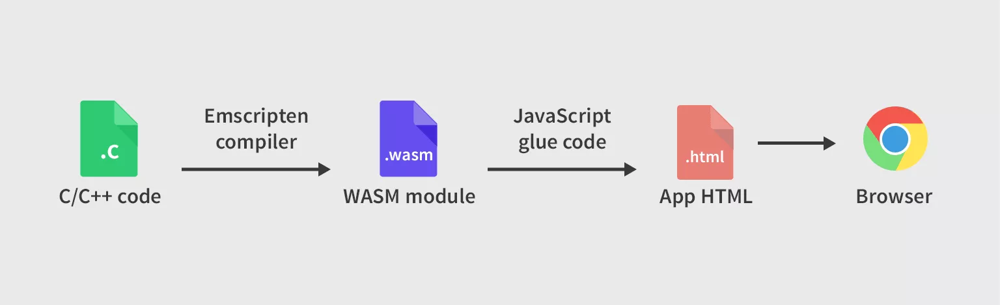
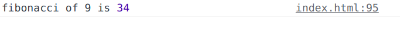

# Web assembly/ WASM
It is a universal binary code that is designed for the web.

Wasm  uses a low virtual machine with a linear memory.It execute safely inside the sandbox.



Image Source :-> [Tapadoo](https://tapadoo.com/wasm-the-future-of-the-web-and-how-affect-the-app-market/)


## When should we use WASM?
Whenever we need to do heavy computation, we should use wasm as they are efficient and fast. 

## But why Rust?
You can choose any language that you wish to but [Rust](https://rustwasm.github.io/docs/book/why-rust-and-webassembly.html) provides low level control over the memopry and free from non-deterministic garbage collection.


## Let's create our Fibonacci wasm package

### 1. Creating/ Intialising our first lib
Make sure rust is installed. You can install from [here](https://www.rust-lang.org/tools/install) if not installed.

```
$  cargo new fibonacci-wasm --lib
```

### 2. Writing our Fibonacci function in Rust
It's pretty easy to write a function.
```
pub fn fibonacci(n: i64) -> i64 {
    if n == 0 {
        return 0;
    } else if n == 1 {
        return 1;
    } else {
        let mut a = 0;
        let mut b = 1;
        for _i in 2..n {
            let c = a + b;
            a = b;
            b = c;
        }
        return b;
    }
}
```

Apart from this you can do whatever you can do in the browser like consoling, alerting etc.

 - You can use the [web_sys](https://rustwasm.github.io/wasm-bindgen/api/web_sys/) which provides the web browser api's in the Rust code. 
- **web_sys** is a part of **wasm-bindgen** which extends the functionality what you can do with the Rust code. 
- For JS bindings you can use the [js_sys](https://docs.rs/js-sys/0.3.60/js_sys/) which provides binding to JavaScript’s standard, built-in objects, including their methods and properties

You can use the [web_sys](https://rustwasm.github.io/wasm-bindgen/api/web_sys/) and [js_sys](https://docs.rs/js-sys/0.3.60/js_sys/) to do whatever you thought of doing in browser.

### 3. Let's create JS binding with our Rust code
It is a difficult part but we have crate/library to do this. 

We will be using  to  Facilitate high-level interactions between Wasm modules and JavaScript.

Binding our rust code with js is simple with the help of **wasm_bindgen** macro.
```
use wasm_bindgen::prelude::*;

#[wasm_bindgen]
pub fn fibonacci(n: i64) -> i64 {
    ....
}
```

Most od the things are done. 

### 4. Let's compile and generate wasm package with wasm-pack

**wasm-pack** -> one-stop solution for working with rust generated wasm code with the javascript.

YOu can use the **wasm-pack** to easily publish to **npm registry** or use it inside in **node_modules** folder.

You can install wasm-pack [here](https://rustwasm.github.io/wasm-pack/installer/).

```
$ wasm-pack build --target web
```

Now you can find new folder created with the name **pkg**.

You can just import WebAssembly modules the same way you would import JavaScript modules. 


### 5. Testing our package in browser
- Create a basic html page and in the body section add the **script tag** with type **module**.
    ```
    <script type="module">
    ```

- Importing the wasm package.
    ```
        <script type="module">
        import init, { fibonacci } from "./pkg/fibonacci_wasm.js";
        ....
        </script>
    ```

- Initilising our wasm code
    ```
    <script type="module">
      import init, { fibonacci } from "./pkg/fibonacci_wasm.js";

      await init();
      ....
    </script>
    ```

- Running our fibnacci function
    ```
    <script type="module">
      import init, { fibonacci } from "./pkg/fibonacci_wasm.js";

      await init();
      console.log(fibonacci(10));
    </script>
    ```

### Results



### Resources
1. [iJS 2021: WebAssembly, Rust, and TypeScript – a Match Made in Heaven](https://www.youtube.com/watch?v=zq4s3LAUz4A)

Feel free to ask queries and make pull request for changes and suggestion in GitHub.

Happy Hacking   
**Rustaceans!**